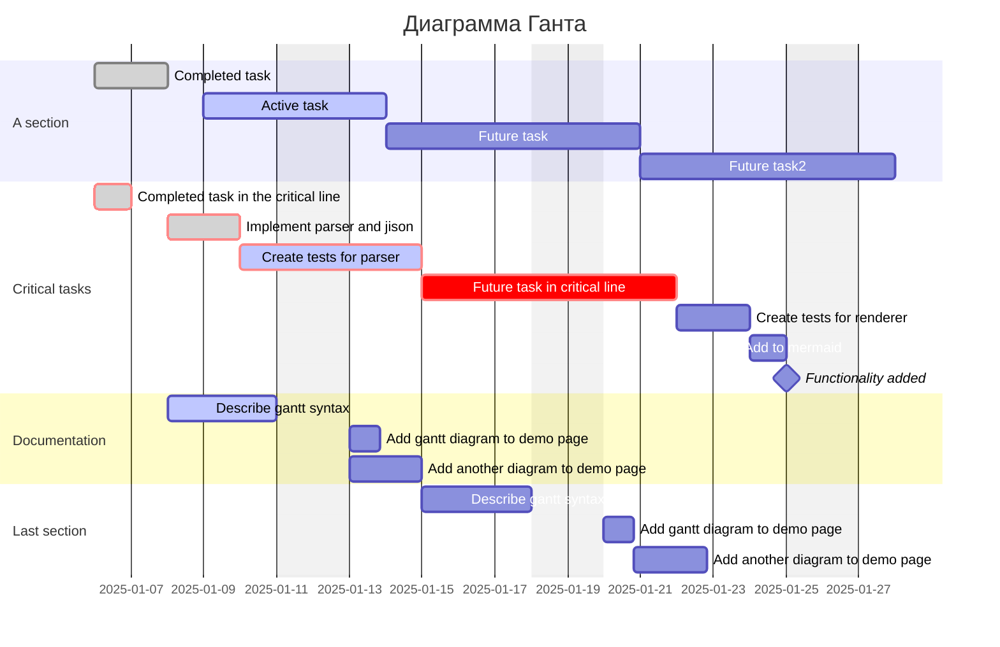

# 1. Главные команды Markdown

## 1.1. Базовые команды форматирования

### 1.1.1. Уровни заголовков

<center>

<!-- markdownlint-disable MD025 -->
# Heading 1 <!-- omit from toc -->
<!-- markdownlint-enable MD025 -->
## Heading 2<!-- omit from toc -->

### Heading 3<!-- omit from toc -->

#### Heading 4<!-- omit from toc -->

##### Heading 5<!-- omit from toc -->

###### Heading 6<!-- omit from toc -->

</center>

### 1.1.2. Начертания шрифтов
<!-- markdownlint-disable MD036 -->
**Жирный шрифт**

*Курсив*
<!-- markdownlint-enable MD036 -->
> Цитата

<u>Подчеркнутый</u>

~~Зачеркнутый~~

### 1.1.3. Списки

Что покажем из списков:

- Простой список
- Пошаговый
- Список с чекбоксами

---

**Как положить слона в холодильник?**

1. Взять слона
2. Открыть дверь
3. Положить слона в холодильник

---

**Как положить жирафа в холодильник?**

- [x] Открыть холодильник
- [x] Вытащить слона
- [ ] Положить жирафа

### 1.1.4. Особенные блоки

Просто одна строка кода
`print('hello')`

```python
# Если хотим подсветку синтаксиса конкретного языка, то можно использовать такой вариант

some_msg = "I love Markdown!"
print(some_msg)
```

Ссылки тоже можно 👍

[Ссылка гайд](https://www.markdownguide.org/cheat-sheet/)

[Ссылка на списки](#113-списки)

Можно вставить изображение - в полный размер изображения.


Или изменить его так, как нужно.
<center>

</center>

---

## 1.2. Таблицы

| Заголовок1 | Заголовок2 | Заголовок3|
|:-----------|------------:|:-----------:|
| 1|2|3|
|Привет<---| --->Мир| Очень большая строка, которую надо обязательно поместить! |

---

## 1.3. Сноски

В некоторых редакторах Markdown есть поддержка синтаксиса сносок [^1]

[^1]: Или сразу встроенная, или в качестве расширения

## 1.4. Схемы (Дополнительные обработчики)

Остальные примеры [тут](https://mermaid.js.org/ecosystem/tutorials.html)


